# Forensic Evidence Ingestion Tool

[繁體中文](README.md) | English

[](LICENSE)
[]()

This tool is designed specifically for **first responders and forensic examiners to safely preserve and ingest digital evidence back at the workstation**. It addresses common Windows OS limitations such as file transfer lockups on paths longer than 260 characters, slow Explorer transfer speeds, and modification of original directory metadata (creation, modification, and access timestamps) during copy operations. It provides a robust, dual-stage SHA-256 hash matching and integrity verification system conforming to forensic chain-of-custody requirements.

---

## 📊 Workflow & Integrity Flow

When executed, the tool automatically runs the following standard forensic workflow to ensure "Source" and "Destination" data are identical, leaving a secure chain of custody manifest:

```mermaid
flowchart TD
    %% Node Definitions
    Source["📂 Source: Original Seized Evidence (USB/Disk)
    ---------------------------------------------
    • Original files and folders
    • Contains long paths & special characters"]
    
    Subst["⚡ Long Path Defense (subst Mapping)
    ---------------------------------------------
    • Map path temporarily to virtual X:\\ drive"]
    
    SourceHash["🔒 Stage 1: Source Hash Calculation
    ---------------------------------------------
    • Pre-calculate SHA-256 hashes of all source files
    • Lock original evidence state to secure chain of custody"]
    
    Robocopy["🚀 Forensic Preservation Transfer (Robocopy & Metadata Fix)
    ---------------------------------------------
    • Replicate directory & file structure
    • Copy all original metadata & timestamps (DCOPY:DAT / COPY:DAT)
    • Automatically create isolated target folders"]
    
    TargetDir["📂 Destination: Secure Storage (NAS/Backup Drive)
    ---------------------------------------------
    • Fully replicated folder structure
    • 100% identical folder metadata & timestamps"]
    
    Manifest["📄 Output File: Evidence_Manifest_*.csv
    ---------------------------------------------
    • Record relative path, file size, & write timestamps
    • Record SHA-256 hashes and verification status
    • Synced bi-directionally (saved to both source and target)"]
    
    Verify["🛡️ Stage 2: Destination Integrity Verification
    ---------------------------------------------
    • Read target files and re-calculate SHA-256
    • Cross-match target hashes against source hashes
    • Confirm integrity and detect any data corruption"]

    %% Flow Connections
    Source --> Subst
    Subst --> SourceHash
    SourceHash --> Robocopy
    Robocopy --> TargetDir
    TargetDir --> Verify
    Verify --> Manifest
    Manifest -.->|Write-Back Sync| Source

    %% Styling
    style Source fill:#f9fafd,stroke:#2b579a,stroke-width:2px,color:#000
    style Subst fill:#fff7e6,stroke:#d48806,stroke-width:1px,color:#000
    style SourceHash fill:#f0f5ff,stroke:#2f54eb,stroke-width:1px,color:#000
    style Robocopy fill:#f6ffed,stroke:#52c41a,stroke-width:2px,color:#000
    style TargetDir fill:#f6ffed,stroke:#52c41a,stroke-width:2px,color:#000
    style Verify fill:#f9f0ff,stroke:#722ed1,stroke-width:1px,color:#000
    style Manifest fill:#fffbe6,stroke:#faad14,stroke-width:2px,color:#000
```



### 🎯 Key Outcomes
- **New Deliverables**: Creates an isolated case directory in the destination named after the source folder, containing a bi-directionally synced `Evidence_Manifest_[timestamp].csv`.
- **Integrity Preservation**: All copied files and directories retain **exactly identical** timestamps (creation, modification, last access) and system attributes.
- **Forensic Admissibility**: The CSV manifest records relative paths and SHA-256 hashes to serve as objective evidence of non-tampering for legal presentations.

---

## 🚀 Quick Start

You can quickly download and run the tool using either of the following methods:

### Method A: One-Liner PowerShell Download (Recommended)
Open Windows PowerShell, paste and run the following command. This will download and extract the tool to a folder named `Forensic-Evidence-Ingestion-Tool` in your current directory:
```powershell
Invoke-WebRequest -Uri "https://github.com/Chiakai-Chang/Forensic-Evidence-Ingestion-Tool/archive/refs/heads/main.zip" -OutFile "FEIT.zip"; Expand-Archive -Path "FEIT.zip" -DestinationPath "."; Rename-Item -Path "Forensic-Evidence-Ingestion-Tool-main" -NewName "Forensic-Evidence-Ingestion-Tool"; Remove-Item "FEIT.zip"
```
*After the download is complete, open the `Forensic-Evidence-Ingestion-Tool` folder and double-click **`Run_Tool.bat`** to start (UAC elevation is handled automatically).*

### Method B: Direct ZIP Download
1. Click **[Download ZIP](https://github.com/Chiakai-Chang/Forensic-Evidence-Ingestion-Tool/archive/refs/heads/main.zip)** to download the archive.
2. Extract the ZIP file and open the folder.
3. Double-click **`Run_Tool.bat`** to start.

---

### 💡 Step-by-Step Execution Guide
Once the tool is running, the workflow takes only three simple steps:
1. **Launch**: Double-click **`Run_Tool.bat`** (approve the UAC Administrator prompt).
2. **Select Directories**:
   - **Source Directory**: Select the original seized evidence folder (e.g., folder on a write-blocked USB drive).
   - **Destination Directory**: Select the target backup storage folder (e.g., share on a NAS or secure local backup partition).
   - *📌 Note: You **do not** need to pre-create a target folder named after the suspect/case. The tool automatically reads the source folder's name, creates it on the destination, and replicates everything inside it.*
3. **Confirm & Execute**: The paths you selected will be displayed on screen. **Press Enter (Y) to confirm, and the script will automatically execute all remaining phases** (drive mapping, file copying, hashing, and verification) in the background without any manual interaction.

---

## 🌟 Key Features

### 1. Long Path Defense (Long Path Resolution)
To bypass the 260-character Windows path limit (`MAX_PATH`), the tool **dynamically identifies a free drive letter** (searching backwards from `X:` to `D:`) and maps the source folder as a virtual drive using the native `subst` command. This reduces the source path to just 3 characters (e.g., `X:\`), eliminating copy errors on deeply nested directories (e.g., `node_modules` or web caches).

### 2. Forensic Manifest and Robustness
- **Pre-calculation**: Calculates SHA-256 hashes of all source files *before* any network transfer begins, locking the baseline state.
- **Save-First Integrity**: The CSV manifest is saved and synchronized back to the source *before* the post-copy verification stage begins. If the user cancels the verification via `Ctrl + C` or if a network dropout occurs, the baseline manifest remains safe on both drives.
- **Idempotency**: Skips previous `Evidence_Manifest_*.csv` files during subsequent runs.

### 3. Folder & File Timestamp Preservation
- **Preserve Metadata**: Replicates subdirectories and files using Robocopy with `/DCOPY:DAT /COPY:DAT` to copy all write, creation, access times, and attributes.
- **Root Folder Fix**: Explicitly reads the source parent folder's timestamps and clones them to the newly created target directory using .NET file properties, achieving 100% outer folder matching.

### 4. Admin Network Drive Mount Sync
Standard mapped network drives (e.g., `Y:`, `Z:`) are isolated between user and elevated Administrator sessions. The tool automatically queries the registry (`HKCU:\Network`) and mounts these mappings in the background under the elevated context, making them visible in the folder browser.

### 5. Modern P/Invoke Dialog Prompts
Replaces legacy script prompts with a Win32 native API (`MessageBoxTimeout`) popup, rendering standard Windows 10/11 dialog boxes and preventing blocking/hanging. It safely avoids EDR scripting alert blocks.

---

## 🛠️ Technical Details (Robocopy Parameters)

* **`/E`**: Copy subdirectories, including empty ones.
* **`/DCOPY:DAT`**: Copy directory Data, Attributes, and Timestamps.
* **`/COPY:DAT`**: Copy file Data, Attributes, and Timestamps.
* **`/R:2` & `/W:2`**: Retry locked files 2 times, waiting 2 seconds between retries (prevents getting stuck infinitely on locked system files).
* **`/NFL`**: Hide file listing while showing directory processing paths for optimal CLI update performance.

---

## ⚖️ Legal & Forensic Disclaimer
This tool is intended to assist in preserving digital evidence integrity. The generated CSV reports record SHA-256 hashes, file sizes, and write timestamps. For formal forensic submissions, please package these manifests in accordance with your agency's standard operating procedures and chain of custody documentation.

---
**Developer**: [Chiakai Chang](mailto:contact.chiakai.chang@gmail.com)  
**License**: [MIT License](LICENSE)
