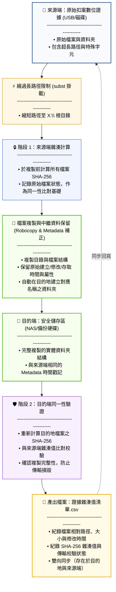
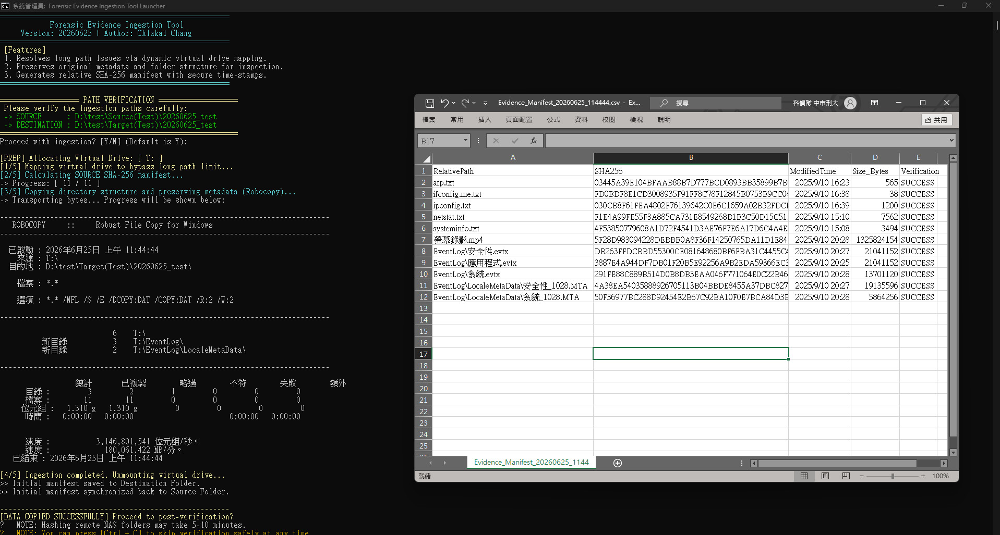
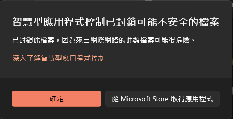
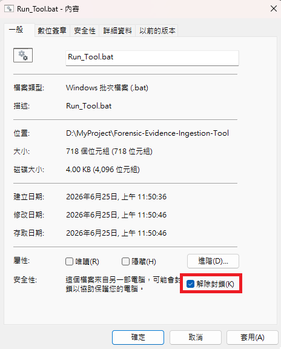

# Forensic Evidence Ingestion Tool (FEIT)

繁體中文 | [English](README.en.md)

[](LICENSE)
[]()

本工具專為**現場數位鑑識人員返回駐地後保存與歸檔數位證據**所設計。旨在解決 Windows 系統下複製超長路徑檔案時容易卡死、傳輸緩慢，以及檔案與資料夾時間戳記（Metadata Timestamps）在複製過程中遭到修改等實務痛點，同時提供符合數位證據監管鏈（Chain of Custody）與同一性要求之雙重 SHA-256 雜湊比對與驗證機制。

## 📊 運作架構與數據同一性流程 (Workflow & Integrity Flow)

本工具在執行時，會自動進行以下標準鑑識工作流，確保「來源端」與「目的端」資料完全一致並留下驗證憑證：



### 🎯 執行後所實現的成果
- **新增內容**：目的地自動建立與來源資料夾同名的資料夾，且其下會自動產出雙向同步的 `Evidence_Manifest_[時間戳記].csv` 清單。
- **證據同一性**：所有被複製的檔案、資料夾皆保留原本的建立/修改/存取時間與系統屬性。
- **同一性證明**：產出的 CSV 清單詳細紀錄了每個檔案相對於根目錄的相對路徑與 SHA-256 雜湊值，作為數位證據同一性比對之客觀憑證。

### 🖥️ 實際運行展示 (Execution Demo)

以下為本工具在 Windows 系統下的實際運行畫面（包含主程式執行終端機，以及產出之同一性驗證 CSV 清單檔案格式）：



---

## 🚀 快速上手 (Quick Start)

您可以使用以下任一方式快速取得工具並執行：

### 方法 A：一鍵指令下載（適用於終端機與指令操作）
開啟 Windows PowerShell，貼上並執行以下指令。這將會自動下載工具包並解壓縮至當前路徑下的 `Forensic-Evidence-Ingestion-Tool` 資料夾：
```powershell
Invoke-WebRequest -Uri "https://github.com/Chiakai-Chang/Forensic-Evidence-Ingestion-Tool/archive/refs/heads/main.zip" -OutFile "FEIT.zip"; Expand-Archive -Path "FEIT.zip" -DestinationPath "."; Rename-Item -Path "Forensic-Evidence-Ingestion-Tool-main" -NewName "Forensic-Evidence-Ingestion-Tool"; Remove-Item "FEIT.zip"
```
*下載完成後，進入 `Forensic-Evidence-Ingestion-Tool` 資料夾，直接雙擊執行 **`Run_Tool.bat`** 即可啟動（工具會自動要求 UAC 管理員權限）。*

### 方法 B：直接下載 ZIP 壓縮檔（適用於瀏覽器下載）
1. 點擊 **[下載 ZIP 壓縮檔](https://github.com/Chiakai-Chang/Forensic-Evidence-Ingestion-Tool/archive/refs/heads/main.zip)** 取得工具包。
2. 解壓縮後，進入該資料夾。
3. 直接雙擊執行 **`Run_Tool.bat`**，即可啟動圖形選擇介面開始運作。

### ⚠️ 執行前安全提示與 Windows 封鎖排除

由於 Windows 系統的資安機制（如 Smart App Control 智慧型應用程式控制或 SmartScreen），從網路下載的批次檔（`.bat`）與 PowerShell 腳本（`.ps1`）在首次執行時**極可能會被系統自動封鎖**，並跳出如下提示：



作為鑑識人員，**請務必保持資安警覺，切勿盲目相信並執行任何來源不明的程式碼**。建議您依循以下步驟進行驗證與解除封鎖：

1. **原始碼審查**：本工具完全開源，所有程式碼均在 [Evidence_Ingest_Tool.ps1](file:///D:/MyProject/Forensic-Evidence-Ingestion-Tool/Evidence_Ingest_Tool.ps1) 與 [Run_Tool.bat](file:///D:/MyProject/Forensic-Evidence-Ingestion-Tool/Run_Tool.bat) 中，您可以直接使用文字編輯器（如 Notepad++、VS Code）開啟並逐行檢視程式碼，確認沒有惡意行為。
2. **防毒軟體掃描**：使用單位內建的 Windows Defender 或第三方防毒軟體，對下載的資料夾進行手動掃描。
3. **解除封鎖（Mark of the Web 排除）**：
   - 在 **`Run_Tool.bat`** 檔案上按右鍵，選擇 **「內容」**。
   - 在「一般」索引標籤的最下方，找到「安全性」區段，勾選 **「解除封鎖」**，然後點擊「確定」或「套用」。
   
   
   
*完成上述步驟後，即可正常雙擊執行 `Run_Tool.bat` 開始進行證據複製工作。*

### 💡 執行與操作步驟
下載並解壓縮完成後，執行與歸檔只需簡單三步：
1. **啟動**：直接雙擊執行 **`Run_Tool.bat`** 啟動工具。
2. **選擇路徑**：
   - **來源資料夾**：選擇您要備份的原始證據資料夾（如隨身碟或外接碟上的個案資料）。
   - **目的地資料夾**：選擇要存放的安全備份位置（如 NAS 或單位公用分享區）。
   - *📌 註：目的地**不需要**事先手動建立與案號或嫌疑人同名的空資料夾，工具會自動擷取來源資料夾名稱，並在目的地自動建立該資料夾後開始傳輸，防止手動輸入出錯。*
3. **確認與啟動**：選擇路徑後，視窗中會列出您選取的來源與目的地路徑。**核對無誤後按 Enter (Y) 確認，程式便會自動在背景完成虛擬磁碟掛載、複製檔案與中繼資料、計算與比對雜湊值等程序**，無需手動介入。

---
## 🌟 核心特色 (Key Features)

### 1. 解決超長路徑限制 (Long Path Resolution)
Windows 檔案總管預設有 260 字元的路徑長度限制（`MAX_PATH`）。本工具在複製前，會**自動動態分配一個未使用的虛擬磁碟機代號**（優先從 `X:` 往回搜尋至 `D:`），並利用 `subst` 指令將來源資料夾暫時掛載為該虛擬碟。此舉能將來源路徑長度縮短至 3 個字元（如 `X:\`），避免因路徑過長導致複製失敗。

### 2. 數位證據同一性確保 (Chain of Custody & Integrity)
- **複製前計算雜湊值**：在複製檔案前，先在來源端計算所有檔案的 **SHA-256 雜湊值**，記錄檔案大小與最後修改時間。
- **相對路徑設計**：雜湊值清單以**相對路徑**儲存（相對於虛擬碟根目錄），即使日後整批證據移動到不同的儲存媒體或鑑識工作站，雜湊值比對亦不受絕對路徑變動的影響。
- **即時寫入清單**：在檔案複製完成後，**立刻寫入並同步**初始的 CSV 驗證清單。即使在後續的「目的端雜湊驗證」過程中中途手動取消或因網路斷線，已計算的來源端雜湊值清單也早已安全寫入，不會遺失。

### 3. 中繼資料與屬性保留 (Metadata & Timestamps Preservation)
- **目錄與檔案完整性**：Robocopy 複製時預設使用 `/DCOPY:DAT /COPY:DAT` 參數，將所有子目錄與檔案的原始修改時間、建立時間、存取時間以及系統屬性寫入目的地。
- **根目錄時間戳記修復**：由於 Robocopy 無法將「來源根目錄」的時間戳記直接套用到「目的地根目錄」，腳本在複製結束後會自動透過 .NET 物件將來源根目錄的 `CreationTime`、`LastWriteTime`、`LastAccessTime` 與 `Attributes` 寫入目的地資料夾，確保根目錄之中繼資料與屬性一致。

### 4. 解決 UAC 管理員權限下「網路磁碟機隱形」問題
在 Windows 安全機制下（Split Token / UAC Isolation），「一般使用者」掛載的網路分享磁碟機（如 `Y:` 槽、`Z:` 槽）在「以系統管理員權限」執行的命令列中是完全隱形的。
本工具在啟動時會自動讀取註冊表 `HKCU:\Network` 紀錄，**在背景將使用者原有的網路磁碟連線動態克隆至管理員權限內**，使同仁在圖形選擇介面中能直接選取、寫入 NAS 或公用分享區，無需手動輸入複雜的 UNC IP 路徑。

### 5. 採用 P/Invoke MessageBoxTimeout
本工具採用 **Win32 API (`MessageBoxTimeout`)** 進行對話框呼叫，其外觀與 Windows 系統風格一致，且能**避免使用傳統 Scripting 元件，防止被端點防護軟體（EDR）誤判或阻擋**。此視窗提供 10 秒自動倒數，逾時未回應則自動開始目的端的雜湊值驗證。

---

## 📂 專案檔案結構 (Project Structure)

* **[Evidence_Ingest_Tool.ps1](file:///D:/MyProject/Forensic-Evidence-Ingestion-Tool/Evidence_Ingest_Tool.ps1)**：PowerShell 核心鑑識歸檔與驗證模組。
* **[Run_Tool.bat](file:///D:/MyProject/Forensic-Evidence-Ingestion-Tool/Run_Tool.bat)**：全英文批次啟動檔，負責檢查並自動提權至系統管理員（UAC Bypass / Request Admin），並安全呼叫 PowerShell。
* **[.gitignore](file:///D:/MyProject/Forensic-Evidence-Ingestion-Tool/.gitignore)**：Git 忽略清單，已預先排除產出的臨時證據 CSV 報告與系統殘留檔。
* **[LICENSE](file:///D:/MyProject/Forensic-Evidence-Ingestion-Tool/LICENSE)**：MIT 授權條款。

---

## 🛠️ 技術細節與 Robocopy 參數說明

* **`/E`**：複製所有子目錄（包含空目錄）。
* **`/DCOPY:DAT`**：複製目錄的資料 (Data)、屬性 (Attributes) 與時間戳記 (Timestamps)。
* **`/COPY:DAT`**：複製檔案的資料 (Data)、屬性 (Attributes) 與時間戳記 (Timestamps)。
* **`/R:2` 與 `/W:2`**：遇到鎖定檔案時最多重試 2 次，每次等待 2 秒（預設為重試 100 萬次，改為 2 次可避免因少數損毀檔導致整個傳輸卡死）。
* **`/NFL` / `/NDL` / `/NJH` / `/NJS`**：在傳輸十萬級別的小檔案時，隱藏單一檔案與目錄名稱，這能省去螢幕 I/O 的更新時間，使傳輸效率最高提升 30% 以上。

---

## ⚖️ 法律與鑑識聲明 (Disclaimer)
本工具主要設計用於數位證據同一性（Integrity）的保持與複製，產出的 CSV 報告包含每個檔案的 SHA-256 雜湊碼、檔案大小與修改時間。在進行正式法庭鑑定或扣案物封存時，請配合各單位標準作業程序（SOP）與監管鏈表單併案存檔，以確保數位證據之證據能力。

---
**開發人員**：[Chiakai Chang](mailto:contact.chiakai.chang@gmail.com)
**專案授權**：[MIT License](LICENSE)
